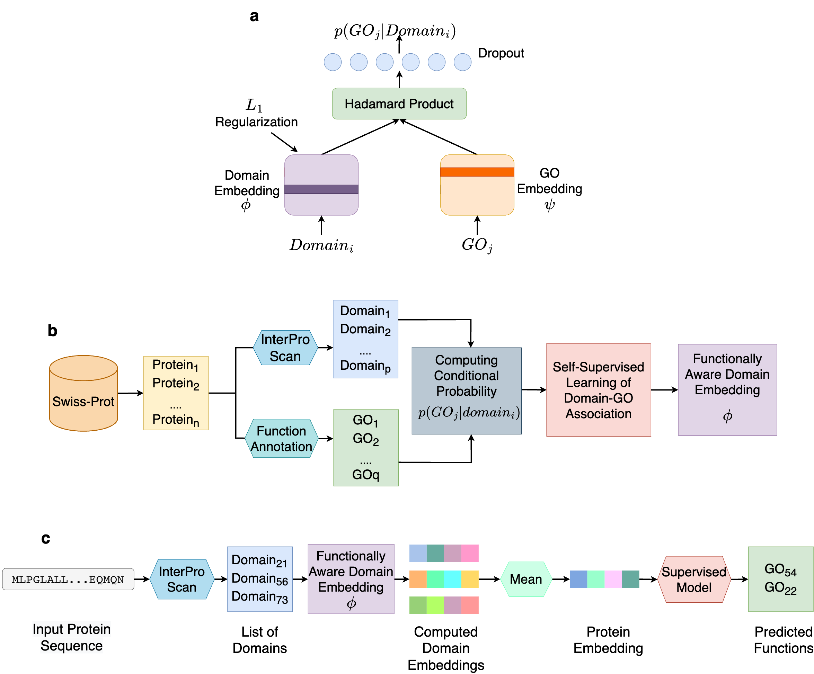

# Domain-PFP 

<a href="https://github.com/marktext/marktext/releases/latest">
   
   
   
   
   
</a>      <br>


Domain-PFP is a self-supervised method to learn functional representations of protein domains that can be used for protein function prediction.

<!-- Copyright (C) -------->

License: GPL v3. (If you are interested in a different license, for example, for commercial use, please contact us.) 

Contact: Daisuke Kihara (dkihara@purdue.edu)

For technical problems or questions, please reach to Nabil Ibtehaz (nibtehaz@purdue.edu).

## Online Platform (run easily and freely on Google Colab)

[https://bit.ly/domain-pfp-colab](https://bit.ly/domain-pfp-colab)

## Introduction
Domains are functional and structural units of proteins that govern various biological functions performed by the proteins. Therefore, characterization of domains in a protein can serve as a proper functional representation of proteins. Here, we employ a self-supervised protocol to derive functionally consistent representations for domains, through learning domain-Gene Ontology (GO) co-occurrences and associations. Domain embeddings constructed with the self-supervised protocol learned functional associations, which turned out effective to perform in actual function prediction tasks. An extensive evaluation shows that the protein representation using the domain embeddings are superior to that of large-scale protein language models in GO prediction tasks. Moreover, the new function prediction method, Domain-PFP, significantly outperformed the state-of-the-art function predictors. Notably, Domain-PFP achieved increase of area under precision-recall curve by 2.43%, 14.58% and 9.57% over the state-of-the-art method for molecular function (MF), biological process (BP) and cellular components (CC), respectively. Moreover, Domain-PFP demonstrated competitive performance in CAFA3 evaluation, by achieving overall the best performance among top teams that participated in the assessment.


## Overall Protocol



Overview of Domain-PFP. 

<ol type="a">
  <li>The network architecture used for self-supervised learning of domain embeddings. </li>
  <li>The overall pipeline of learning the functionally aware domain embeddings.</li>
  <li>The steps of computing the embeddings of a protein and inferring the functions.</li>
</ol>


## Pre-required software
Python 3.9 : https://www.python.org/downloads/    

## Installation  
### 1. [`Install git`](https://git-scm.com/book/en/v2/Getting-Started-Installing-Git) 
### 2. Clone the repository in your computer 
```
git clone https://github.com/kiharalab/Domain-PFP && cd Domain-PFP
```

### 3. Build dependencies.   
You have two options to install dependency on your computer:
#### 3.1 Install with pip and python.
##### 3.1.1[`install pip`](https://pip.pypa.io/en/stable/installing/).
##### 3.1.2  Install dependency in command line.
```
pip3 install -r requirements.txt --user
```
If you encounter any errors, you can install each library one by one:
```
!pip3 install numpy==1.23.5
!pip3 install tqdm==4.64.1
!pip3 install scipy==1.9.3
!pip3 install matplotlib==3.6.2
!pip3 install matplotlib-inline==0.1.6
!pip3 install pandas==1.5.2
!pip3 install seaborn==0.12.1
!pip3 install torch==1.13.0
!pip3 install tabulate==0.9.0
!pip3 install scikit-learn==1.2.0
!pip3 install click==8.0.3
```

Installing the dependencies only require a few minutes on a standard desktop computer.

#### 3.2 Install with anaconda
##### 3.2.1 [`install conda`](). 
##### 3.2.2 Install dependency in command line
```
conda create -n domainpfp python=3.9
conda activate domainpfp
pip3 install -r requirements.txt 
```

Each time when you want to run this code, simply activate the environment by

```
conda activate domainpfp
conda deactivate    (If you want to exit) 
```

## Prepare Data
Please download and unzip the data.zip and saved_models.zip files. Optinally, you may download our blast and ppi database (blast_ppi_database.zip) if you wish to use blast or ppi in your prediction.

[https://kiharalab.org/domainpfp/](https://kiharalab.org/domainpfp/)

```
wget https://kiharalab.org/domainpfp/data.zip
unzip data.zip
wget https://kiharalab.org/domainpfp/saved_models.zip
unzip saved_models.zip
wget https://kiharalab.org/domainpfp/blast_ppi_database.zip
unzip blast_ppi_database.zip
```

## Source Codes

Our implementation of Domain-PFP is provided in the `DomainPFP` directory.

## Experiments and Reproducibility 

All the codes to run the experiments presented in the paper, are provided in the `/experiments` directory.


## Benchmark Results

The result files of CAFA3 and PROBE benchmarks, generated using the official evaluation tool, are provided in the `/results` directory.


## Usage


Here we provide the following functionalities :  


### 1. calculate domain-GO association probabilities

You can use DomainGO_prob to calculate the association probability of a domain and GO term, by providing the domain and GO term

```
python3 domaingo_prob.py:

  -domain              input InterPro domain
  -GO                  input GO term
```

#### Example
```
python3 domaingo_prob.py --domain IPR000003 --GO GO:0006355
```

This usually takes <2 minutes to run.


<br>

### 2. compute functionally aware protein embedding representation

You can use Domain-PFP to compute functionally aware embedding representation of a protein by providing the protein ID or path to a fasta file. You also need to provide the path to the savefile, where the embedding will be saved as a pickle file

```
python3 compute_embeddings.py:

  -protein              UniProt ID of protein
  -fasta                Or provide the fasta file path
  -savefile             Path to save the protein embeddings (as pickle file)
                        (default: emb.p)  
```

#### Example

```
python3 compute_embeddings.py --protein Q6NYN7 --savefile emb_Q6NYN7.p
```

This usually takes <5 minutes to run, depending on the availability of InterProScan server.

***Note: If you wish to use this representation as feature for some functionally relevant downstream task. <br> Please consider applying proper normalization***

<br>

### 3. predict protein functions using Domain-PFP

You can use Domain-PFP to predict the functions by either providing the protein ID or path to a fasta file.

```
python3 predict_functions.py:
  --protein               UniProt ID of protein
  --fasta                 Or provide the fasta file path
  --threshMFO             Threshold for MFO prediction (default: 0.36)
  --threshBPO             Threshold for BPO prediction (default: 0.31)
  --threshCCO             Threshold for CCO prediction (default: 0.36)
  --blast_flag            Optional flag to use DiamondBlast for function prediction
                          (DiamondBlast needs to be installed and assigned to path)
  --diamond_path          Path to Diamond Blast (by default the colab release path is provided)
                          (default='/content/Domain-PFP/diamond')
  --ppi_flag              Optional flag to use String PPI for function prediction
                          (Only works for Uniprot IDs or properly formatted fastas)
  --outfile               Path to the output csv file (optional)
  
```

#### Example

```
python3 predict_functions.py --protein Q6NYN7 --outfile sample_functions/Q6NYN7_functions.csv
```

```
python3 predict_functions.py --fasta sample_protein/Q6NYN7.fasta --outfile sample_functions/Q6NYN7_functions.csv
```

```
python3 predict_functions.py --fasta sample_protein/Q6NYN7.fasta --threshCCO 0.5 --outfile sample_functions/Q6NYN7_functions.csv
```

```
python3 predict_functions.py --fasta sample_protein/Q6NYN7.fasta --threshCCO 0.5 --outfile sample_functions/Q6NYN7_functions.csv --blast_flag --ppi_flag
```


This usually takes <5 minutes to run, depending on the availability of InterProScan server.

(Note: we recommend using our google colab release [https://bit.ly/domain-pfp-colab](https://bit.ly/domain-pfp-colab) to avoid issues with DiamondBlast installation)
<br>


## Example

### Input File
Protein sequence in fasta format.
Our example input can be found in the `sample_protein` directory

### Output File 
Predcited functions for the protein in csv format.
Our example output can be found in the `sample_functions` directory


## Citation:


>"Domain-PFP: Protein Function Prediction Using Function-Aware Domain Embedding Representations, Nabil Ibtehaz, Yuki Kagaya, and Daisuke Kihara, In submission (2023)"
