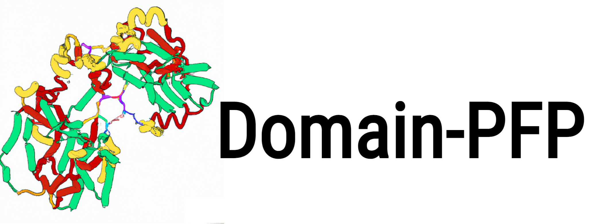
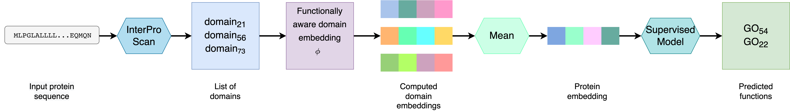

# Domain-PFP 

<a href="https://github.com/marktext/marktext/releases/latest">
   
   
   
   
   
</a>      <br>


Domain-PFP is a self-supervised method to learn functional representations of protein domains that can be used for protein function prediction.

Copyright (C) ------

License: GPL v3. (If you are interested in a different license, for example, for commercial use, please contact us.) 

Contact: Daisuke Kihara (dkihara@purdue.edu)

For technical problems or questions, please reach to Nabil Ibtehaz (nibtehaz@purdue.edu).

## Citation:

....

## Introduction
Domains are functional and structural units of proteins that govern various biological functions performed by the proteins. Therefore, characterization of domains in a protein can serve as a proper functional representation of proteins. Here, we employ a self-supervised protocol to derive functionally consistent representations for domains, through learning domain-Gene Ontology (GO) co-occurrences and associations. Domain embeddings constructed with the self-supervised protocol learned functional associations, which turned out effective to perform in actual function prediction tasks. An extensive evaluation shows that the protein representation using the domain embeddings are superior to that of large-scale protein language models in GO prediction tasks. Moreover, the new function prediction method, Domain-PFP, significantly outperformed the state-of-the-art function predictors. Notably, Domain-PFP achieved increase of area under precision-recall curve by 2.43%, 14.58% and 9.57% over the state-of-the-art method for molecular function (MF), biological process (BP) and cellular components (CC), respectively. Moreover, Domain-PFP demonstrated competitive performance in CAFA3 evaluation, by achieving overall the best performance among top teams that participated in the assessment.


## Overall Protocol




## Pre-required software
Python 3.9 : https://www.python.org/downloads/    

## Installation  
### 1. [`Install git`](https://git-scm.com/book/en/v2/Getting-Started-Installing-Git) 
### 2. Clone the repository in your computer 
```
git clone https://github.com/kiharalab/Domain-PFP && cd Domain-PFP
```

### 3. Build dependencies.   
You have two options to install dependency on your computer:
#### 3.1 Install with pip and python.
##### 3.1.1[`install pip`](https://pip.pypa.io/en/stable/installing/).
##### 3.1.2  Install dependency in command line.
```
pip3 install -r requirements.txt --user
```
If you encounter any errors, you can install each library one by one:
```
!pip3 install numpy==1.23.5
!pip3 install tqdm==4.64.1
!pip3 install scipy==1.9.3
!pip3 install matplotlib==3.6.2
!pip3 install matplotlib-inline==0.1.6
!pip3 install pandas==1.5.2
!pip3 install seaborn==0.12.1
!pip3 install torch==1.13.0
!pip3 install scikit-learn==1.2.0
!pip3 install click==8.0.3
```

#### 3.2 Install with anaconda
##### 3.2.1 [`install conda`](). 
##### 3.2.2 Install dependency in command line
```
conda create -n domainpfp python=3.9
conda activate domainpfp
pip3 install -r requirements.txt 
```

Each time when you want to run this code, simply activate the environment by

```
conda activate domainpfp
conda deactivate    (If you want to exit) 
```

## Prepare Data
Please download and unzip the data.zip and saved_models.zip files

[https://kiharalab.org/domainpfp/](https://kiharalab.org/domainpfp/)


## Usage

Use Domain-PFP to predict the functions by either providing the protein ID or path to a fasta file

```
python3 main.py:
  -protein              UniProt ID of protein
  -fasta                Or provide the fasta file path
  -threshMFO             Threshold for MFO prediction (default: 0.36)
  -threshBPO             Threshold for BPO prediction (default: 0.31)
  -threshCCO             Threshold for CCO prediction (default: 0.36)
  
```

### Running Example
```
python main.py --protein F1QN13
```

```
python main.py --fasta sample_protein/Q6NYN7.fasta
```

```
python main.py --fasta sample_protein/Q6NYN7.fasta --threshCCO 0.5
```

## Experiments

All the codes to run the experiments are provided in /Experiments directory
